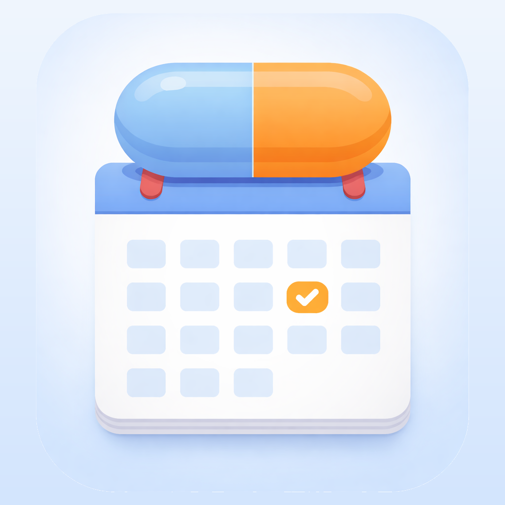

<p align="center">
  
</p>

<h1 align="center">Meds Diary</h1>

<p align="center">
  <em>Your personal health companion — track medicines, supplements & appointments all in one place.</em>
</p>

<p align="center">
  
  
  
  
</p>

---

## ✨ Features

### 💊 Medicine Tracking
> Add and manage your prescriptions with dosage details, frequency, stock levels, and daily intake logging. Never miss a dose again.

### 🍃 Supplement Management
> Keep tabs on your vitamins and supplements — track what you take, when you take it, and how much you have left.

### 🏥 Appointment Scheduling
> Organize medical appointments with doctor info, hospital details, notes, and smart countdowns so you're always prepared.

### 🏠 Dashboard Overview
> A beautiful home screen showing today's medicines, supplements, and your next upcoming appointment at a glance.

### 🔔 Smart Reminders
> Set multiple reminder times per item. Get daily push notifications with encouraging messages to stay on track.

### ☁️ iCloud Sync *(Premium)*
> Seamlessly sync your health data across all your Apple devices with CloudKit.

### 🔒 Privacy First
> Sign in with Apple for privacy-focused authentication. Credentials stored securely in the device Keychain.

---

## 🎨 Design

Meds Diary features a **soft pastel aesthetic** with a carefully curated colour palette:

| Colour | Hex | Usage |
|--------|-----|-------|
| 🔵 Primary Blue | `#A7C7E7` | Primary accent |
| 🫧 Light Blue | `#D6E8F8` | Backgrounds |
| 🔷 Dark Blue | `#6495C6` | Contrast elements |
| 🩷 Pink Accent | `#F5D0DC` | Highlights |
| 🤍 Soft White | `#F8FAFC` | Card backgrounds |

Typography is set in **Poppins** — a clean, modern geometric sans-serif across all weights (Regular, Medium, SemiBold, Bold).

---

## 🏗️ Tech Stack

| Technology | Purpose |
|:-----------|:--------|
| **SwiftUI** | Declarative UI framework |
| **SwiftData** | Local data persistence |
| **CloudKit** | Cloud sync (premium) |
| **StoreKit 2** | In-app purchases & subscriptions |
| **UserNotifications** | Push notifications & reminders |
| **AuthenticationServices** | Sign in with Apple |
| **Keychain** | Secure credential storage |

---

## 📂 Project Structure

```
medi-diary-app/
├── Models/
│   ├── Medicine.swift
│   ├── Supplement.swift
│   └── Appointment.swift
├── Views/
│   ├── Dashboard/          # Home screen & cards
│   ├── Medicines/          # Medicine CRUD views
│   ├── Supplements/        # Supplement CRUD views
│   ├── Appointments/       # Appointment management
│   ├── MainTabView.swift   # Tab navigation
│   ├── OnboardingView.swift
│   ├── PaywallView.swift
│   ├── SettingsView.swift
│   └── SignInView.swift
├── Services/
│   ├── AuthenticationManager.swift
│   ├── KeychainHelper.swift
│   ├── NotificationManager.swift
│   └── SubscriptionManager.swift
├── Theme/
│   └── PastelTheme.swift
└── Fonts/
    └── Poppins-*.ttf
```

---

## 💎 Premium

| | Free | Premium |
|:--|:--:|:--:|
| Medicines & supplements | Up to 5 | **Unlimited** |
| Appointments | Unlimited | Unlimited |
| Smart reminders | Unlimited | Unlimited |
| iCloud sync | — | **Included** |

Available as **monthly**, **yearly**, or **lifetime** purchase.

---

## 🚀 Getting Started

1. **Clone the repo**
   ```bash
   git clone git@github.com:alia-abdrahman/meds-diary-app.git
   ```
2. **Open in Xcode 15+**
   ```bash
   open medi-diary-app.xcodeproj
   ```
3. **Build & Run** on a simulator or device running iOS 17+

---

<p align="center">
  Made with 💙 by <strong>Coded & Coffee</strong>
</p>
